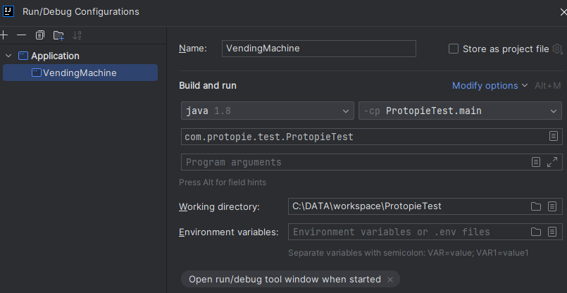

# [Protopie] Software Engineer (Backend) 과제

## 1. 구현 설명

- 자판기 초기 재고 정보는 랜덤함수를 통해 생성되도록 하였습니다.
    - 자판기에서 취급하는 음료의 개수는 11 ~ 20개 사이로 생성이 됩니다.
    - 전제조건에 있는 3가지 음료 중 하나를 선택하여 임의의 재고 개수를 생성하도록 하였습니다.
    - 자판기에서 동일한 음료를 여러 칸으로 제공하는 것이 일반적이기 때문에 coke_1, coke_2 등과 같이 생성하도록 하였습니다.
    - 한 칸에 있는 음료의 최대 개수는 1 ~ 10개 사이로 생성이 됩니다.
- 로직이 시작되면, 초기 재고 정보를 노출하면서 결제 수단을 선택하도록 합니다.
- 신용카드 결제
    - MM/YY 형태의 카드 유효기간을 입력받고, 오늘 날짜와 비교하여 만료된 카드인지 확인합니다.
      - 만료되었을 경우 다른 결제수단이 있는지 확인합니다.
      - 만료되지 않았을 경우 카드 결제한도를 입력받습니다.
- 체크카드 결제
  - 체크카드도 유효기간이 있긴 하지만, 신용카드와 로직을 다르게 하기 위해 생략하였습니다.
  - 대신 연결된 계좌 잔액을 입력받습니다.
- 현금 결제
  - 전제조건에 있는 5가지 권종 중 하나를 선택하고 개수를 입력받습니다.
  - 권종과 개수를 곱하여 현금 총액을 계산합니다.
- 다시 한번 재고 정보를 노출하여 음료를 선택하도록 하고, 위 3가지 결제 수단 선택을 통해 만들어진 금액과 비교합니다.
  - 선택된 음료에 대해 재고 정보를 업데이트하게 되고, 재고가 없을 경우 재고 정보에 노출되지 않도록 하였습니다.
  - 추가로 원하는 음료가 있을 경우,
    - 신용/체크카드는 다시 결제해야 하기 때문에 결제수단 선택을 보여줍니다.
    - 현금은 남아있는 금액이 있기 때문에 음료 선택을 보여줍니다.
      - 남아있는 금액이 새로 선택한 음료의 가격보다 적을 경우 추가로 현금 투입하는 단계로 진입합니다.
  - 추가로 원하는 음료가 없을 경우,
    - 신용/체크카드는 거스름돈이 존재하지 않기 때문에 바로 종료가 됩니다.
    - 현금은 거스름돈 유무를 판단하여 있을 경우 거스름돈에 대한 처리가 추가되고, 없을 경우 바로 종료가 됩니다.
- StringConfig 클래스를 통해 문자열을 효율적으로 관리하도록 하였습니다.

## 2. 개발 스택

    - Java 8
    - Gradle

## 3. 실행 방법

1. git clone 명령어를 통해 프로젝트를 가져옵니다.
    ```
    git clone https://github.com/jhsol87/hansol-vending-machine.git
    ```
2. 프로젝트 파일을 실행합니다. (Intellij 기준 Run configuration 을 통해 Application 을 설정합니다.)

3. 아래의 예시와 같이 입력하여 결과를 확인합니다.

## 4. 예시
```text
  자판기 재고 현황
  [1] coke_1 : 1100원 (10개)
  [2] coke_2 : 1100원 (8개)
  [3] coffee_1 : 700원 (10개)
  [4] coke_3 : 1100원 (9개)
  [5] coke_4 : 1100원 (2개)
  [6] coffee_2 : 700원 (1개)
  [7] coffee_3 : 700원 (6개)
  [8] water_1 : 600원 (5개)
  [9] coke_5 : 1100원 (8개)
  [10] water_2 : 600원 (10개)
  [11] coke_6 : 1100원 (8개)
  [12] coffee_4 : 700원 (1개)
  [13] water_3 : 600원 (6개)
  [14] coke_7 : 1100원 (2개)
  [15] coffee_5 : 700원 (3개)
  [16] coffee_6 : 700원 (4개)
  [17] water_4 : 600원 (5개)
  원하는 음료수가 있는가?
  [1] CREDIT_CARD
  [2] DEBIT_CARD
  [3] CASH
  결제수단을 선택하세요. (1, 2, 3): 1
  유효기간을 확인하세요. (MM/YY): 01/25
  신용카드의 유효기간이 지났습니다.
  다른 결제수단이 있는가? (Y, N): Y
  [1] CREDIT_CARD
  [2] DEBIT_CARD
  [3] CASH
  결제수단을 선택하세요. (1, 2, 3): 1
  유효기간을 확인하세요. (MM/YY): 12/25
  결제한도를 확인하세요. (예: 5000): 5000
  자판기 재고 현황
  [1] coke_1 : 1100원 (10개)
  [2] coke_2 : 1100원 (8개)
  [3] coffee_1 : 700원 (10개)
  [4] coke_3 : 1100원 (9개)
  [5] coke_4 : 1100원 (2개)
  [6] coffee_2 : 700원 (1개)
  [7] coffee_3 : 700원 (6개)
  [8] water_1 : 600원 (5개)
  [9] coke_5 : 1100원 (8개)
  [10] water_2 : 600원 (10개)
  [11] coke_6 : 1100원 (8개)
  [12] coffee_4 : 700원 (1개)
  [13] water_3 : 600원 (6개)
  [14] coke_7 : 1100원 (2개)
  [15] coffee_5 : 700원 (3개)
  [16] coffee_6 : 700원 (4개)
  [17] water_4 : 600원 (5개)
  음료수를 선택하세요. (예: coke_1): coke_1
  음료수(coke_1)가 나온다.
  음료수(coke_1)를 꺼낸다.
  추가로 원하는 음료수가 있는가? (Y, N): Y
  [1] CREDIT_CARD
  [2] DEBIT_CARD
  [3] CASH
  결제수단을 선택하세요. (1, 2, 3): 2
  잔액을 확인하세요. (예: 5000): 5000
  자판기 재고 현황
  [1] coke_1 : 1100원 (9개)
  [2] coke_2 : 1100원 (8개)
  [3] coffee_1 : 700원 (10개)
  [4] coke_3 : 1100원 (9개)
  [5] coke_4 : 1100원 (2개)
  [6] coffee_2 : 700원 (1개)
  [7] coffee_3 : 700원 (6개)
  [8] water_1 : 600원 (5개)
  [9] coke_5 : 1100원 (8개)
  [10] water_2 : 600원 (10개)
  [11] coke_6 : 1100원 (8개)
  [12] coffee_4 : 700원 (1개)
  [13] water_3 : 600원 (6개)
  [14] coke_7 : 1100원 (2개)
  [15] coffee_5 : 700원 (3개)
  [16] coffee_6 : 700원 (4개)
  [17] water_4 : 600원 (5개)
  음료수를 선택하세요. (예: coke_1): coffee_4
  음료수(coffee_4)가 나온다.
  음료수(coffee_4)를 꺼낸다.
  추가로 원하는 음료수가 있는가? (Y, N): Y
  [1] CREDIT_CARD
  [2] DEBIT_CARD
  [3] CASH
  결제수단을 선택하세요. (1, 2, 3): 3
  현금을 투입하세요. (예: 500[권종] 5[개수]): 500 5
  투입 금액: 2500원
  자판기 재고 현황
  [1] coke_1 : 1100원 (9개)
  [2] coke_2 : 1100원 (8개)
  [3] coffee_1 : 700원 (10개)
  [4] coke_3 : 1100원 (9개)
  [5] coke_4 : 1100원 (2개)
  [6] coffee_2 : 700원 (1개)
  [7] coffee_3 : 700원 (6개)
  [8] water_1 : 600원 (5개)
  [9] coke_5 : 1100원 (8개)
  [10] water_2 : 600원 (10개)
  [11] coke_6 : 1100원 (8개)
  [12] water_3 : 600원 (6개)
  [13] coke_7 : 1100원 (2개)
  [14] coffee_5 : 700원 (3개)
  [15] coffee_6 : 700원 (4개)
  [16] water_4 : 600원 (5개)
  음료수를 선택하세요. (예: coke_1): water_3
  음료수(water_3)가 나온다.
  음료수(water_3)를 꺼낸다.
  추가로 원하는 음료수가 있는가? (Y, N): N
  거스름돈(1900원)이 나온다.
  거스름돈(1900원)을 꺼낸다.
  종료
```